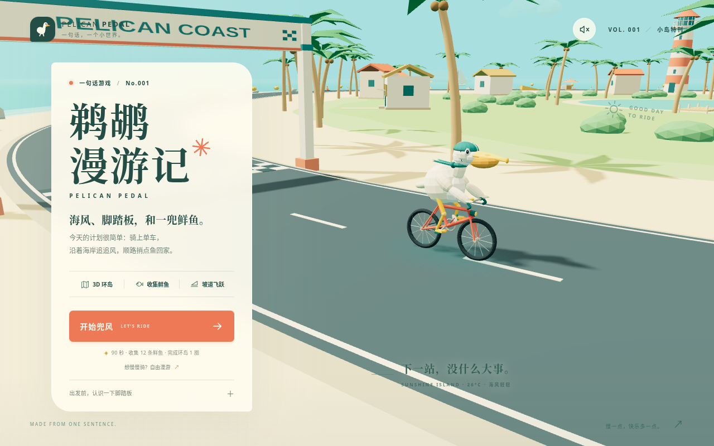

# 鹈鹕漫游记 · Pelican Pedal

骑上自行车，带着鹈鹕沿海岛公路兜风：收集小鱼、跃过坡道，在海风和棕榈树之间完成一圈挑战。

这是 `sentence-to-game` 的第 001 个游戏，使用 Three.js 和 Vite 制作的低多边形风格浏览器 3D 游戏。

默认部署地址：[开始骑行](https://qzemi.cn/sentence-to-game/games/001-pelican-pedal/)。

游戏合集：[qzemi.cn/sentence-to-game](https://qzemi.cn/sentence-to-game/)。



## 怎么玩

- **海岛挑战**：在 90 秒内收集至少 12 条小鱼，并骑完一圈。
- **自由骑行**：沿环岛路线探索，练习转弯、跳跃和加速。
- 利用坡道起跳，穿过鱼群，留意路上的交通锥。
- 可切换镜头和程序生成的音效；最佳成绩保存在当前浏览器中。

| 操作        | 键盘                |
| ----------- | ------------------- |
| 踩踏加速    | `W` / `↑`           |
| 刹车        | `S` / `↓`           |
| 左右转向    | `A`、`D` / `←`、`→` |
| 跳跃        | `Space`             |
| 冲刺        | `Shift`             |
| 暂停 / 继续 | `P` / `Esc`         |
| 重新开始    | `R`                 |
| 切换镜头    | `C`                 |
| 切换声音    | `M`                 |

触屏设备可使用画面上的方向、加速、刹车、跳跃和冲刺按钮。游戏需要支持 WebGL 的现代浏览器。

## 本地运行

安装 Node.js 20.19+、22.12+ 或 24 后，在仓库根目录执行：

```bash
cd games/001-pelican-pedal
npm ci
npm run dev -- --host 0.0.0.0
```

在浏览器中打开 Vite 终端显示的地址，默认端口为 `5173`。

## 构建与检查

在游戏目录中执行：

```bash
npm test
npm run build
npm run preview -- --host 0.0.0.0
```

`npm test` 运行 Node.js 测试。`npm run build` 生成 `dist/`，预览命令用于本地检查构建产物。

Vite 使用相对资源路径（`base: './'`），游戏默认发布到 `https://qzemi.cn/sentence-to-game/games/001-pelican-pedal/`。

完成上述构建后，在仓库根目录运行：

```bash
python3 scripts/build-site.py
```

该命令将 `dist/` 复制到 `docs/games/001-pelican-pedal/` 并更新合集首页。将源码和生成的 `docs/` 一起提交到 `main`，由现有 GitHub Pages 配置发布。

## 提示词与源码

- [原始提示词](prompt.txt)
- [游戏源码](src/)

游戏中的模型、场景和音效由代码生成。

## 已验证

- 22 项玩法测试：跨圈收集与碰撞、跳跃、坡道、冲刺、计时边界和胜负判定。
- Chromium 实际通关，以及暂停、超时结算、重开、最高分保存和自由骑行。
- 桌面、手机竖屏和横屏布局；触屏冲刺与点按跳跃。
- 生产构建及构建产物的浏览器运行。
