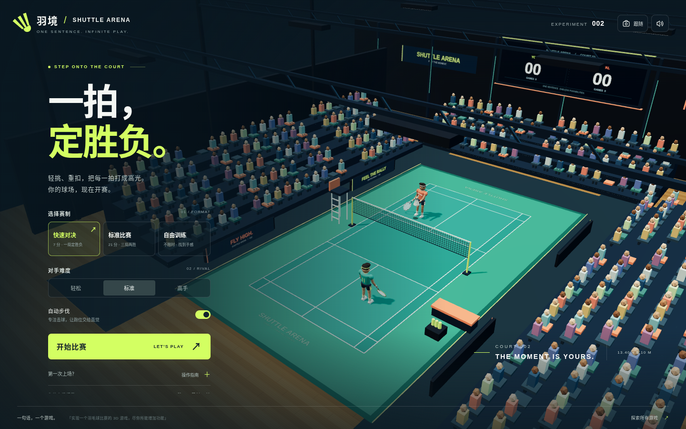

# 羽境 · Shuttle Arena

走进 3D 羽毛球馆，用高远球调动对手、吊球抢占网前，再抓住机会杀球得分。

这是 `sentence-to-game` 的第 002 个游戏，使用 Three.js 和 Vite 制作的浏览器 3D 羽毛球单打游戏。

默认部署地址：[开始比赛](https://qzemi.cn/sentence-to-game/games/002-shuttle-arena/)。

游戏合集：[qzemi.cn/sentence-to-game](https://qzemi.cn/sentence-to-game/)。



## 怎么玩

选择比赛模式和对手难度，发球后将羽毛球击向对方场地，并在来球落地前回击。默认开启辅助跑位：角色自动接近来球，你负责判断时机、选择球路和瞄准。使用方向键可以主动调整站位，也可以按 `H` 关闭辅助跑位，完全手动控制。

- **快速比赛**：一局 7 分，需领先 2 分；打到 10 平后，先得 11 分者获胜。
- **标准比赛**：每局 21 分、三局两胜，需领先 2 分；打到 29 平后，先得 30 分者获胜。
- **无限训练**：练习接球、落点和不同击球方式。
- **三档 AI**：简单、普通、困难，按熟练程度选择对手。
- **高远球、吊球、杀球**：结合左右瞄准和冲刺，尝试不同的攻防节奏。
- 可切换镜头、辅助跑位和程序生成的音效；战绩保存在当前浏览器中。

本作采用街机单打规则，处理界内、出界、下网、落地、得分和发球权变化，便于快速开始比赛。它并非完整的 BWF 裁判规则模拟。

| 操作          | 键盘 / 鼠标                 |
| ------------- | --------------------------- |
| 移动          | `W`、`A`、`S`、`D` / 方向键 |
| 发球 / 高远球 | `Space`                     |
| 吊球          | `J`                         |
| 杀球          | `K`                         |
| 左右瞄准      | `Q` / `E`                   |
| 选择落点      | 鼠标点击对方半场            |
| 冲刺          | `Shift`                     |
| 切换辅助跑位  | `H`                         |
| 暂停 / 继续   | `P` / `Esc`                 |
| 重新开始      | `R`                         |
| 切换镜头      | `C`                         |
| 切换声音      | `M`                         |

触屏设备可使用画面上的方向、冲刺、击球和发球按钮。游戏需要支持 WebGL 的现代浏览器。

## 本地运行

安装 Node.js 20.19+、22.12+ 或 24 后，在仓库根目录执行：

```bash
cd games/002-shuttle-arena
npm ci
npm run dev -- --host 0.0.0.0 --port 5174
```

在浏览器中打开 Vite 终端显示的地址，默认使用端口 `5174`。

## 构建与检查

在游戏目录中执行：

```bash
npm test
npm run build
npm run preview -- --host 0.0.0.0
```

`npm test` 使用 Node.js 原生测试运行器。`npm run build` 生成 `dist/`，预览命令用于本地检查构建产物。

27 项规则测试覆盖平分加赛与封顶、三局两胜、发球权与对角发球、界内与出界、下网、三种球路、瞄准、体力与跑位、提前击球缓存和完整 AI 对局。浏览器试玩检查了实际回球、暂停恢复、手动移动、触屏按钮及本地纪录保存，并检查了桌面、手机竖屏与横屏布局。

Vite 使用相对资源路径（`base: './'`），游戏默认发布到 `https://qzemi.cn/sentence-to-game/games/002-shuttle-arena/`。

完成游戏构建后，在仓库根目录运行：

```bash
python3 scripts/build-site.py
```

该命令将 `dist/` 复制到 `docs/games/002-shuttle-arena/` 并更新合集首页。将源码、说明和生成的 `docs/` 一起提交到 `main`，由现有 GitHub Pages 配置发布。

## 提示词与源码

- [原始提示词](prompt.txt)
- [游戏源码](src/)

游戏采用纯前端实现，模型、场景和音效由代码生成，不依赖外部素材服务。
