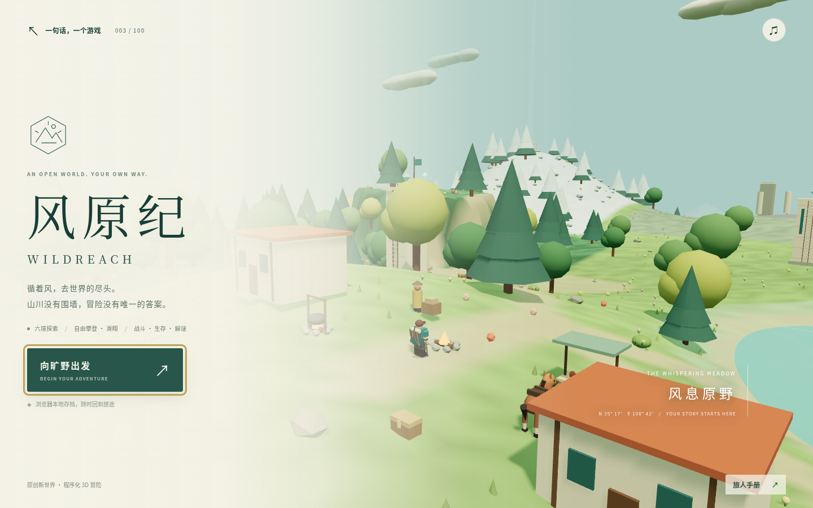

# 风原纪 · Wildreach

背上行囊，穿越草原、森林、湖泊、沙丘与雪地，点亮三座古老信标，挑战遗迹深处的守卫。

这是 `sentence-to-game` 的第 003 个游戏：受开放世界探索玩法启发，以 Three.js 和 Vite 制作的原创浏览器 3D 冒险。它把攀爬、滑翔、战斗、生存、收集和机关探索浓缩在一片可自由行走的地图中；角色、美术、地名和关卡均为原创。地图规模和系统深度属于小型网页游戏，不等同于原作的全部内容或完整商业游戏。

默认部署地址：[启程探索](https://qzemi.cn/sentence-to-game/games/003-wildreach/)。

游戏合集：[qzemi.cn/sentence-to-game](https://qzemi.cn/sentence-to-game/)。



## 怎么玩

从营地出发，沿途收集食材和材料，拜访旅人、商店与料理锅。主线目标是解开风、焰、霜三座信标的机关，激活信标，再击败遗迹守卫。可以先探索、收集和强化装备，再推进主线。

- **自由探索**：步行、冲刺、跳跃、攀爬、滑翔、游泳与骑马；体力影响连续行动。
- **环境变化**：昼夜循环、晴雨与雷暴；雪地与沙漠需要留意温度和装备。
- **战斗与装备**：近战连击、盾牌防御、闪避、弓箭，带有耐久的武器与多种防具。
- **四种符文**：遥控炸弹、磁力、时停与冰柱，用于战斗或环境互动。
- **收集与成长**：拾取资源、开启宝箱、料理、购物，强化生命与体力。
- **地图与旅行**：发现地标、激活高塔，并使用地图上的快速旅行入口。
- **进度保存**：在当前浏览器保存和继续冒险。

## 操作

| 操作                  | 键盘 / 鼠标                              |
| --------------------- | ---------------------------------------- |
| 移动                  | `W`、`A`、`S`、`D` / 方向键              |
| 冲刺                  | 按住 `Shift`                             |
| 跳跃 / 空中展开滑翔伞 | `Space`                                  |
| 攀爬                  | 面向可攀爬的结构，向前移动并按住 `Space` |
| 近战攻击              | `J` / 鼠标左键                           |
| 盾牌防御              | 按住 `K`                                 |
| 弓箭                  | `F`                                      |
| 闪避                  | `L`                                      |
| 交互、拾取、开箱      | `E`                                      |
| 上马 / 下马           | 靠近马后按 `E` / 骑乘时按 `E`            |
| 使用当前符文          | `Q`                                      |
| 切换符文              | `R`                                      |
| 背包、装备、食物      | `I`                                      |
| 世界地图              | `M`                                      |
| 暂停 / 返回           | `Esc` / `P`                              |
| 转动镜头              | 鼠标右键拖动 / 手指拖动画面              |
| 调整镜头距离          | 鼠标滚轮                                 |

触屏设备可使用画面上的方向和动作按钮。靠近人物、料理锅、宝箱或机关时，屏幕会显示当前可执行的交互。打开背包查看物品说明、切换装备和使用食物；在地图中选择已解锁的传送地点。

游戏需要支持 WebGL 的现代浏览器。模型、地形与音效均在本地由代码生成，游玩过程中无需外部素材服务。

## 探索建议

先熟悉营地周围的资源与商店，再进入偏远区域。冲刺、攀爬、游泳和滑翔都需要管理体力；面对远处敌人时可先用弓箭或符文创造机会，再接近战斗。盾牌朝向来袭方向可以减伤，在攻击到来前及时举盾可以触发完美格挡。

为守望人米拉带来 3 份木材，可以换取霜绒斗篷与 30 枚晶币；获得装备后还需要在背包中穿上。进入雪地前准备保暖手段，前往沙漠时留意耐热装备。

高塔需要攀至塔顶后交互才能同步，成功后解锁传送点并获得风之印记。风之印记可在背包中用于提升生命或精力上限。武器命中后会消耗耐久，弓箭还需要箭矢；行脚商人可以补充箭矢、出售装备和修理武器。

在营地炊锅可以制作以下料理，完成后从背包食用：

| 料理     | 材料                   | 效果                              |
| -------- | ---------------------- | --------------------------------- |
| 山野炖菜 | 野苹果 × 1、山野菌 × 1 | 恢复 55 点生命                    |
| 暖阳汤   | 暖阳草 × 1、山野菌 × 1 | 恢复 35 点生命，获得 3 分钟抗寒   |
| 精力烤菌 | 暖阳草 × 1、野苹果 × 1 | 恢复全部精力，90 秒内加快精力恢复 |

符文无需在旅途中寻找，可随时用 `R` 轮换，并用 `Q` 施放：

| 符文     | 使用方法                                                       |
| -------- | -------------------------------------------------------------- |
| 遥控炸弹 | 投出炸弹，再次施放可提前引爆；爆炸伤害范围内的敌人             |
| 磁引之手 | 牵引附近的金属方块，移动并调整朝向，再次施放放下               |
| 时停锁定 | 暂停附近敌人的行动，期间累积的伤害在解除后结算                 |
| 冰桥共鸣 | 在前方生成临时冰柱，可踏足并短暂冻结附近敌人，也能唤醒霜冠冰晶 |

冒险进度会自动保存，也可使用暂停菜单中的保存按钮。营火休息能恢复生命、精力并更新复活点；倒下后会失去 5 枚晶币，已经完成的探索保留。存档保存在当前浏览器的本地存储中，菜单中的继续游戏会读取该存档。

<details>
<summary>三座信标的解法（含机关剧透）</summary>

1. **风之信标**：选择磁力符文，将附近的金属方块移动到标记位置。机关完成后，靠近信标交互。
2. **焰之信标**：收集至少两份木材，与附近的火炬交互点燃。再与信标交互。
3. **霜之信标**：用弓箭击中附近的晶体，或在信标附近使用冰柱符文。再与信标交互。
4. 三座信标全部亮起后，前往遗迹挑战守卫。

</details>

## 本地运行

安装 Node.js 20.19+、22.12+ 或 24 后，在仓库根目录执行：

```bash
cd games/003-wildreach
npm ci
npm run dev -- --host 0.0.0.0 --port 5175
```

在浏览器中打开 Vite 终端显示的地址，默认使用端口 `5175`。

## 构建与检查

在游戏目录中执行：

```bash
npm test
npm run build
npm run preview -- --host 0.0.0.0 --port 4175
```

测试使用 Node.js 原生测试运行器。构建产物位于 `dist/`，预览默认使用端口 `4175`。Vite 使用相对资源路径（`base: './'`），可直接部署在合集的游戏子路径下。

45 项自动化测试覆盖移动与体力、天气与温度、装备经济、四种符文、三座机关、战斗与首领、死亡恢复及存档校验。其中完整冒险测试从新游戏出发，仅使用实际玩家操作完成委托、探索、装备购买和最终挑战。

浏览器验证包括实际键盘采集与委托、攀塔、滑翔、装备、射箭、炸弹、暂停存档与刷新续玩；桌面、手机横竖屏布局和触屏移动、冲刺、跳跃、滑翔均已检查。发布构建也验证了合集子路径下的资源加载与主要操作。

完成游戏构建后，在仓库根目录运行：

```bash
python3 scripts/build-site.py
```

该命令将 `dist/` 复制到 `docs/games/003-wildreach/` 并更新合集首页。将源码、说明和生成的 `docs/` 一起提交到 `main`，由现有 GitHub Pages 配置发布到默认域名。

## 提示词与源码

- [原始提示词](prompt.txt)
- [游戏源码](src/)

第三方 Three.js 的许可声明随构建产物保留于 `THREE-LICENSE.txt`。
