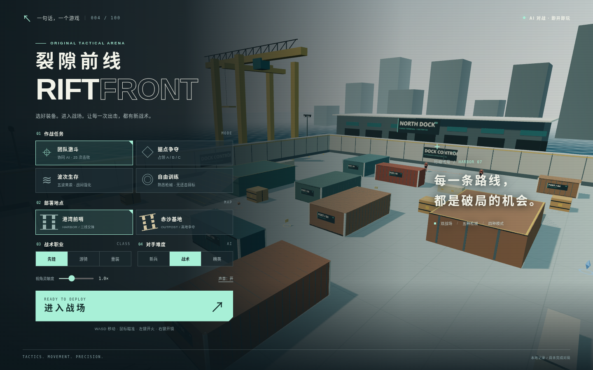

# 裂隙前线 · Riftfront

在集装箱之间寻找射击角度，冲上高台夺取据点，或与队友守住不断来袭的敌人。

这是 `sentence-to-game` 的第 004 个游戏：使用 Three.js 和 Vite 制作的原创浏览器第一人称 3D 射击游戏。你将与 AI 队友和 AI 对手作战，可以选择团队激斗、据点争夺、波次生存或自由训练。

默认部署地址：[进入战场](https://qzemi.cn/sentence-to-game/games/004-riftfront/)。

游戏合集：[qzemi.cn/sentence-to-game](https://qzemi.cn/sentence-to-game/)。



## 怎么玩

在开始界面选择模式、地图、职业与难度，进入战场后使用掩体移动，瞄准并射击对手。队友以蓝绿色标识，敌人以红色标识；可以通过小地图、据点状态和比分了解战局。

| 模式 | 目标 |
| --- | --- |
| 团队激斗 | 你与两名 AI 队友迎战三名 AI 对手，率先获得 25 次击败；限时 5 分钟 |
| 据点争夺 | 占领 A、B、C 据点，持续累积分数；目标 150 分，限时 6 分钟 |
| 波次生存 | 与一名 AI 队友迎战 5 波敌人，拥有 3 次生命，并在波次间选择强化 |
| 自由训练 | 练习瞄准、爆头、换弹和武器手感，训练敌人不会开火，可随时结束 |

两张地图提供不同的掩体、通道与高台；五种武器覆盖近距离到远距离交战。三种职业调整生命、护甲、移动与初始武器，三档 AI 难度适合不同熟练程度。

团队激斗和据点争夺的时间用尽时，分数更高的队伍获胜，同分则平局。训练可以通过画面上或暂停菜单中的「结束训练」查看本次统计。

- **射击与战斗**：开镜瞄准、后坐力、散布、爆头、距离衰减、弹匣与备弹、换弹、近战和手雷。
- **移动**：冲刺、跳跃、蹲伏与滑铲；体力会限制连续冲刺和滑铲。
- **战场互动**：掩体阻挡射线，可摧毁的箱体与可拾取的生命、护甲、弹药及手雷补给。
- **战况反馈**：命中提示、击杀信息、伤害方向、计分板、小地图、据点状态和赛后统计。
- **队伍规则**：队友伤害关闭；团队激斗与据点争夺中可复活，生存模式需要保留剩余生命。
- **游玩记录**：本地保存比赛战绩，训练不会计入胜场。

## 操作

| 操作 | 键盘 / 鼠标 |
| --- | --- |
| 移动 | `W`、`A`、`S`、`D` / 方向键 |
| 转动视角 | 移动鼠标 |
| 开火 | 按住鼠标左键 |
| 开镜瞄准 | 按住鼠标右键 |
| 冲刺 | 按住 `Shift` |
| 跳跃 | `Space` |
| 蹲伏 | 按住 `C` / `Ctrl` |
| 滑铲 | 在地面移动时按 `V` |
| 换弹 | `R` |
| 手雷 | `G` |
| 近战 | `F` |
| 选择武器 | `1` 至 `5` |
| 循环切换武器 | 鼠标滚轮 |
| 计分板 | 按住 `Tab` |
| 暂停 | `Esc` |
| 切换暂停 / 继续 | `P` / 点击继续按钮 |

桌面端进入游戏后可点击画面锁定鼠标；鼠标捕获不可用时，按住右键拖动瞄准，左键开火。触屏设备使用画面上的方向和动作按钮移动、开火与换弹，拖动空白区域转动视角，点击瞄准按钮切换开镜状态，使用「切枪」按钮轮换武器。各武器均支持按住开火，视角灵敏度可在开始界面调整。

## 武器与战术

| 按键 | 武器 | 弹匣 | 适用场景 |
| --- | --- | --- | --- |
| `1` | AR-7 先锋 · 突击步枪 | 30 | 中距离交火，兼顾射速与威力 |
| `2` | V-9 脉冲 · 冲锋枪 | 36 | 近距离绕侧和快速交火 |
| `3` | M-8 破门者 · 霰弹枪 | 7 | 狭窄通道、转角与近距离交战 |
| `4` | S-5 长弓 · 狙击步枪 | 5 | 借助高台和掩体进行远距离瞄准 |
| `5` | K-12 游隼 · 轻型手枪 | 12 | 近中距离补枪与武器切换练习 |

停下脚步、蹲伏和开镜可以提高射击精度；移动与跳跃会扩大散布。换弹需要完成计时才会把备弹装入弹匣，中途切换武器或滑铲会中断换弹。空弹匣继续开火会尝试自动换弹。

受伤后先回到掩体，连续 6 秒未受伤会开始恢复生命；护甲需要补给。手雷会在 1.8 秒后爆炸，近距离爆炸也可能伤到自己。尽量从侧翼迫使敌人离开掩体，并留意可摧毁箱体造成的射击线路变化。

争夺据点时站入圆形区域：单人占领需要 5 秒，两名队友同时进入可缩短至 2.5 秒。敌我同时在场会暂停占领进度和该据点的积分；离开后已经占领的据点仍会持续得分。

生存模式五轮分别有 5、7、9、11、13 名敌人，波次间可以选择提高生命、护甲或补给，结合剩余生命调整打法。普通对战中倒下后等待 4 秒复活，生存模式还需消耗剩余生命。

连续击败 3 名敌人可获得护甲与手雷补给，连续击败 5 名敌人会开启 8 秒侦察雷达。倒下会重置连击计数。生存模式每轮结束后选择一项强化即可进入下一波；无论选择哪项强化，都会恢复生命并补满全部武器的弹药。

| 生存强化 | 效果 |
| --- | --- |
| 生命强化 | 生命上限 +25 |
| 装甲强化 | 护甲上限 +25，并补满护甲 |
| 火力补给 | 体力上限 +20，手雷补至 4 枚 |

自由训练中包含固定与移动目标，并持续补充换弹所需的备弹。命中率按「命中敌人的开火次数 ÷ 总开火次数」计算；霰弹枪一次开火即使多颗弹丸命中，也只计一次命中。

## 地图与职业

- **港湾前哨**：集装箱与高台交错，以三条路线连接出生区和中央货场。
- **赤沙基地**：开阔火线、低矮掩体与两侧观测平台，适合争夺交叉路口。

| 职业 | 生命 | 护甲 | 初始武器 | 特点 |
| --- | --- | --- | --- | --- |
| 先锋 | 100 | 60 | 突击步枪 | 均衡火力与防护 |
| 游骑 | 90 | 40 | 冲锋枪 | 移动更快，精力更多 |
| 重装 | 120 | 90 | 霰弹枪 | 防护更高，移动较慢 |

职业决定初始属性与握持的武器，进入战场后仍可切换全部五种武器。AI 难度分为新兵、战术和精英，影响反应、射击误差与伤害。

## 本地运行

安装 Node.js 20.19+、22.12+ 或 24 后，在仓库根目录执行：

```bash
cd games/004-riftfront
npm ci
npm run dev -- --host 0.0.0.0 --port 5176
```

在浏览器中打开 Vite 终端显示的地址，默认使用端口 `5176`。游戏需要支持 WebGL 的现代浏览器。

## 构建与检查

在游戏目录中执行：

```bash
npm test
npm run build
npm run preview -- --host 0.0.0.0 --port 4176
```

测试使用 Node.js 原生测试运行器。构建产物位于 `dist/`，预览默认使用端口 `4176`。Vite 使用相对资源路径（`base: './'`），便于在合集的游戏子路径中运行。

浏览器检查覆盖实际命中与击败、左右键组合开镜射击、五枪切换、换弹与手雷、跳跃蹲伏滑铲、暂停结算、地图切换，以及手机三指同时移动、转向和开火。正式子路径的桌面与手机横竖屏检查通过，四作页面与引用资源均返回成功响应，未出现脚本错误或资源请求失败。

42 项规则测试已通过，覆盖命中与爆头、掩体遮挡、友伤与爆炸、装填与弹药、移动碰撞与坡道、AI 寻路、据点计分、复活、生存波次和奖励。其中完整团队比赛测试仅通过移动、瞄准与开火输入赢得一场比赛。

完成游戏构建后，在仓库根目录运行：

```bash
python3 scripts/build-site.py
```

该命令将 `dist/` 复制到 `docs/games/004-riftfront/` 并更新合集首页。将源码、说明和生成的 `docs/` 一起提交到 `main`，由现有 GitHub Pages 配置发布到默认域名。

## 提示词与源码

- [原始提示词](prompt.txt)
- [游戏源码](src/)

本作采用纯前端实现，场景、角色、武器与音效由代码生成，游玩过程中无需外部素材服务。第三方 Three.js 的许可声明随构建产物保留于 `THREE-LICENSE.txt`。
