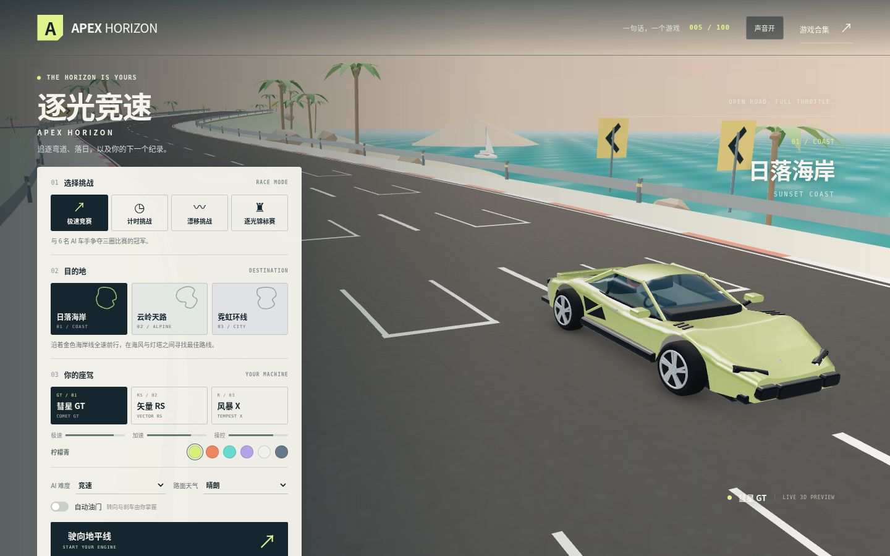

# 逐光竞速 · APEX HORIZON

沿海岸追逐落日，在山路间寻找弯心，穿过霓虹映照的城市。选择自己的赛车和涂装，用刹车、漂移与氮气跑出更快的一圈。

这是 `sentence-to-game` 的第 005 个游戏：使用 Three.js 和 Vite 制作的原创浏览器 3D 街机赛车游戏。你可以与六名 AI 车手争夺名次，也可以独自挑战圈速或漂移分数。

默认部署地址：[驰骋赛道](https://qzemi.cn/sentence-to-game/games/005-apex-horizon/)。

游戏合集：[qzemi.cn/sentence-to-game](https://qzemi.cn/sentence-to-game/)。



## 怎么玩

在开始界面选择比赛模式、赛道、赛车和涂装，并设置 AI 难度与天气。发车后沿赛道依次通过检查点，完成规定圈数；切弯、逆行或重置车辆都不能跳过检查点。

| 模式 | 目标 |
| --- | --- |
| 极速竞赛 | 与六名 AI 车手完成三圈比赛，争夺终点名次 |
| 计时挑战 | 独自完成三圈，与个人最佳圈的幽灵车比拼 |
| 漂移挑战 | 在 90 秒内连续漂移并安全收车，争取更高分数 |
| 逐光锦标赛 | 依次参加海岸、山地和城市三站比赛，累积积分 |

三款赛车提供不同的加速、极速和操控表现；六种涂装只改变外观。三档 AI 难度会改变对手的驾驶表现，湿滑天气则降低车辆抓地力。

- **驾驶与竞赛**：油门、刹车与倒车、手刹漂移、氮气加速、车辆和护栏碰撞、顺序检查点、圈速与名次。
- **车辆维护**：碰撞会损失车况；拾取赛道上的维修补给恢复车况，拾取氮气补给增加储量。
- **比赛信息**：速度表、圈数、计时、排行榜、小地图、氮气与车况，以及逆行、驶出路面和漂移连击提示。
- **本地记录**：比赛与胜场、最快有效圈速和漂移纪录保存在当前浏览器中。

## 操作

| 操作 | 键盘 |
| --- | --- |
| 油门 | `W` / `↑` |
| 刹车 / 停车后倒车 | `S` / `↓` |
| 左转 / 右转 | `A`、`D` / `←`、`→` |
| 氮气加速 | 按住 `Shift` |
| 手刹漂移 | 按住 `Space` |
| 切换追逐 / 引擎盖 / 高位视角 | `C` |
| 向后看 | 按住 `Q` |
| 重置车辆 | `R`，增加 3 秒罚时 |
| 暂停 | `Esc` |
| 切换暂停 / 继续 | `P` / 画面中的继续按钮 |
| 开关声音 | `M` |

触屏设备使用屏幕上的转向、油门、刹车、氮气和手刹按钮，可以同时按住多个按钮。开始界面提供自动油门选项：开启后，未刹车时车辆会自动加速，适合触屏操作；过弯仍需主动转向和减速。

## 驾驶技巧与规则

入弯前刹车，接近弯心时稳定转向，出弯后再使用氮气。氮气会随时间缓慢恢复，成功漂移和赛道补给也能帮助补充；储量耗尽时无法持续加速。

驶出柏油路会增加阻力，护栏碰撞会损失速度与车况。车况过低还会影响动力，因此补给并非只有落后时才有用。重置可以将车辆放回安全检查点，但会增加 3 秒罚时，并使当前圈失去最快圈与幽灵记录资格。

漂移需要足够速度和车身侧滑角度，并保持在路面内。分数先计入连击，持续漂移每 1.5 秒提高一次倍率，最高 5 倍；稳定收车 0.65 秒后结算。碰撞或驶出路面会丢失尚未结算的分数；挑战时间结束时，剩余连击分数会计入总分。铜、银、金牌目标分别为 2,500、6,000 和 10,000 分。

极速竞赛与锦标赛在玩家完成第三圈时结算；已冲线车手按完赛时间排序，其余车手按赛程进度排序。

逐光锦标赛按每站名次分配 10、8、6、4、3、2、1 分。每站结算后继续下一站，三站完成后比较总积分。

## 个人记录与幽灵车

最快有效圈速、幽灵车和漂移纪录按「赛道 × 车型 × 天气」分别保存。极速竞赛、计时挑战和锦标赛中的有效圈都可以刷新个人最佳并记录轨迹；只有计时挑战会显示幽灵车，并给出与它的时间差。首次游玩某种组合时，需要先完成一圈有效记录。

重置后的当前圈仍计入比赛圈数和完赛时间，但不会刷新最佳圈速或幽灵车。记录仅保存在当前浏览器中。完赛场次包含四种模式的每次结算；胜场只计算极速竞赛冠军和锦标赛单站冠军，锦标赛各站分别计数。

## 赛道与赛车

| 赛道 | 环境与特点 |
| --- | --- |
| 日落海岸 · SUNSET COAST | 沿金色海岸线前行，在连续海岸弯道中保持节奏 |
| 云岭天路 · ALPINE SKYLINE | 高地起伏、连续山弯与隧道，需要提前减速入弯 |
| 霓虹环线 · NEON CIRCUIT | 城市夜景与长直道，适合把握氮气超车时机 |

| 赛车 | 驾驶特点 |
| --- | --- |
| 彗星 GT · COMET GT | 加速、速度与操控均衡，适合熟悉各条赛道 |
| 矢量 RS · VECTOR RS | 轻量、起步敏捷、抓地力强，适合连续弯道 |
| 风暴 X · TEMPEST X | 极速更高，刹车和入弯需要留出更多余量 |

可选涂装为柠檬青、日落橙、冰川蓝、星云紫、云母白和石墨灰。AI 难度分为漫游、竞速和精英；天气分为晴朗和雨后，雨后抓地力降低，应更早刹车并减少急转。

## 本地运行

安装 Node.js 20.19+、22.12+ 或 24 后，在仓库根目录执行：

```bash
cd games/005-apex-horizon
npm ci
npm run dev -- --host 0.0.0.0 --port 5177
```

在浏览器中打开 Vite 终端显示的地址，默认使用端口 `5177`。游戏需要支持 WebGL 的现代浏览器。

## 构建与检查

在游戏目录中执行：

```bash
npm test
npm run build
npm run preview -- --host 0.0.0.0 --port 4177
```

测试使用 Node.js 原生测试运行器。构建产物位于 `dist/`，预览默认使用端口 `4177`。Vite 使用相对资源路径（`base: './'`），便于在合集的游戏子路径中运行。

35 项规则测试已通过，覆盖赛道闭合与投影、加速与倒车、左右转向、氮气、湿地抓地力、漂移入账、碰撞、检查点、重置罚时、补给和 AI 难度。完整比赛测试通过油门、刹车与转向输入驾驶三圈，并覆盖三站锦标赛的积分延续。

生产构建已通过。浏览器试玩使用实际键盘输入零碰撞完成三圈计时挑战，并验证了最佳圈幽灵轨迹的保存与回放。手机端验证了油门、转向和氮气的三指同时操作及独立松开，以及刹车、重置、视角切换、暂停和横竖屏布局。

完成游戏构建后，在仓库根目录运行：

```bash
python3 scripts/build-site.py
```

该命令将 `dist/` 复制到 `docs/games/005-apex-horizon/` 并更新合集首页。将源码、说明和生成的 `docs/` 一起提交到 `main`，由现有 GitHub Pages 配置发布到默认域名。

## 提示词与源码

- [原始提示词](prompt.txt)
- [游戏源码](src/)

本作采用纯前端实现，赛道、赛车、场景与音效由代码生成，游玩过程中无需外部素材服务。第三方 Three.js 的许可声明随构建产物保留于 `THREE-LICENSE.txt`。
