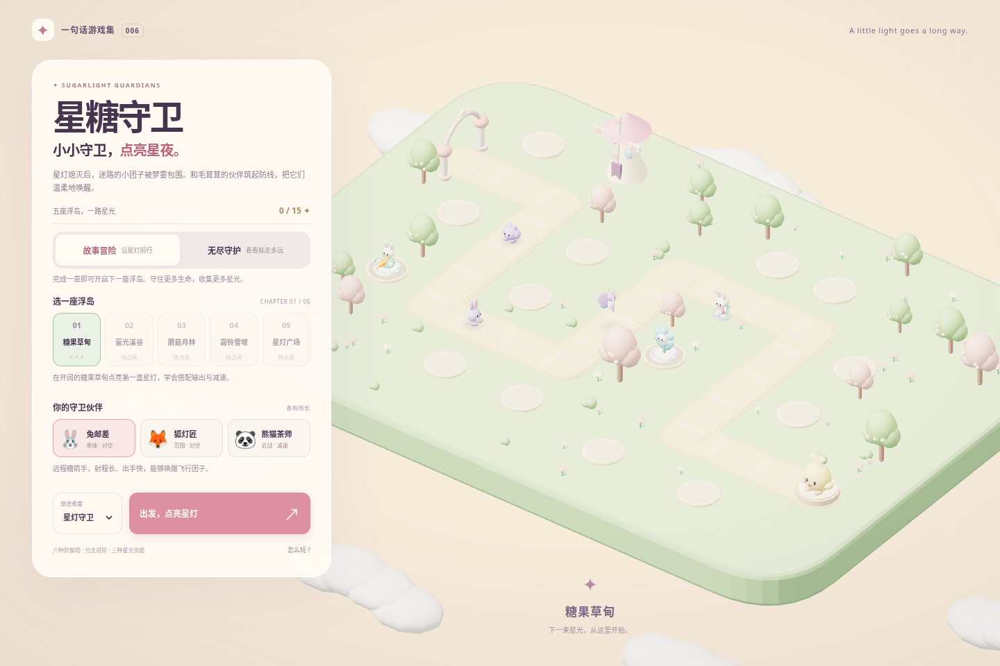

# 星糖守卫 · Sugarlight Guardians

「一句话一个游戏」第 006 作，一款原创童话风格的单人 3D 塔防游戏。

> 实现一个 3D 塔防类游戏，故事主线由你设计，要求画风和角色可爱，尽你能力丰富游戏玩法

游玩地址：https://qzemi.cn/sentence-to-game/games/006-sugarlight-guardians/



## 故事

星灯节前夜，梦游团子带走了小镇的星光。兔邮差 **Momo**、狐狸 **Pip** 与熊猫 **Bao** 穿过草甸、溪谷、月林和雪坡，用糖果魔法唤醒团子，逐步揭开迷雾团长寻找归途的秘密。

每章有独立开场与通关剧情。守住星灯、找回邀请函上遗失的名字，故事会在第五章迎来完整结局。

| 章节 | 场景     | 波数 | 路线 |
| ---- | -------- | ---: | ---- |
| 01   | 糖果草甸 |    6 | 单路 |
| 02   | 萤光溪谷 |    7 | 单路 |
| 03   | 蘑菇月林 |    8 | 单路 |
| 04   | 霜铃雪坡 |    9 | 双路 |
| 05   | 星灯广场 |   10 | 双路 |

## 玩法

- **故事冒险**：五章共 40 波，逐章推进剧情。首章开放，上一章获得至少一枚星章即可解锁下一章。
- **无尽守护**：可选择全部五张地图，挑战不断增强的团子队伍，记录最高守住波数。
- **三档难度**：暖心故事、星灯守卫、勇气之夜。
- **六类守卫塔**：初始全部可建造；各有三级强化，升到第三级时选择专精分支。
- **三位英雄**：选择一位伙伴上场，使用集结指令调整守卫位置。
- **三种主动魔法**：消耗星光能量并具有独立冷却，配合防线处理危急波次。
- **多种团子能力**：快跑、护甲、飞行、治疗、分裂，以及抗减速首领；根据敌人能力安排防空、范围攻击和控制。
- **节奏控制**：手动开启波次，支持自动开波、暂停与 1 / 2 / 3 倍速。
- **键鼠与触屏操作**：点选建造，观察攻击范围，旋转与缩放 3D 场景。
- **原创美术与声音**：程序化构建可爱的角色、浮岛与糖果守卫，搭配合成音效。

### 守卫塔与专精

| 守卫       | 职责         | 第三级专精（二选一）                                     |
| ---------- | ------------ | -------------------------------------------------------- |
| 胡萝卜弩台 | 单体远程攻击 | 流星长弓：提高伤害与射程；双叶快弩：提高攻速             |
| 莓果投手   | 范围攻击     | 星莓派对：扩大范围；暖莓糖浆：追加持续伤害               |
| 霜糖风铃   | 减速控制     | 深雪摇篮：强化减速；雪花合唱：群体减速                   |
| 星火线圈   | 连锁攻击     | 银河接力：增加连锁目标；晴空闪光：强化重击并短暂停顿     |
| 蜂蜜小屋   | 持续伤害     | 蜜花飞沫：群体持续伤害；黏糖抱抱：持续伤害并减速         |
| 花灯花园   | 经济与支援   | 丰糖温室：提高每波糖果收入；星光花环：提供攻速与射程光环 |

### 英雄与魔法

| 英雄        | 能力                         |
| ----------- | ---------------------------- |
| 兔邮差 Momo | 远程攻击，可对付飞行团子     |
| 狐狸 Pip    | 范围攻击，可对付飞行团子     |
| 熊猫 Bao    | 近战攻击并减速，专注地面敌人 |

| 魔法     | 作用                               |
| -------- | ---------------------------------- |
| 星糖雨   | 对选定区域造成魔法伤害             |
| 晚安结界 | 在选定位置布置持续减速区域         |
| 团圆钟   | 修复星灯，并短时间提高全场守卫攻速 |

## 操作

| 操作                           | 按键 / 手势                              |
| ------------------------------ | ---------------------------------------- |
| 选择六类守卫塔                 | `1`–`6`                                  |
| 建造 / 选择守卫 / 放置已选技能 | 鼠标左键点选                             |
| 星糖雨 / 晚安结界 / 团圆钟     | `Q` / `W` / `E`                          |
| 集结英雄                       | `H`，随后点选目的地                      |
| 开启下一波                     | `Space`                                  |
| 暂停 / 继续                    | `P`；`Esc` 可取消选择或暂停              |
| 切换 1 / 2 / 3 倍速            | `F`                                      |
| 开关声音                       | `M`                                      |
| 取消待建造或待施放操作         | 鼠标右键或 `Esc`；有待放置操作时优先取消 |
| 旋转视角                       | 在场景空白处拖动                         |
| 缩放视角                       | 鼠标滚轮 / 双指缩放 / 屏幕按钮           |

触屏可先点击守卫卡片，再点选建造位置；点击已建造守卫可查看并选择强化。星糖雨、晚安结界与英雄集结通过屏幕按钮选择，再点选场景目标；团圆钟直接全局生效。开波、速度、暂停与声音均有屏幕按钮。

## 星章与纪录

故事通关按星灯剩余生命评分：满生命 20 点获得三枚星章，至少 12 点获得两枚星章，剩余生命大于零获得一枚星章。五章最多获得 15 枚星章；重复挑战保留历史最佳成绩。

章节星级与无尽最高波数保存在当前浏览器本地，无尽纪录按地图和难度分别统计。清除网站数据会移除本地进度；不同浏览器之间不自动同步。游戏不设永久数值升级。

## 本地开发

使用 Node.js 24 和 npm：

```bash
cd games/006-sugarlight-guardians
npm ci
npm run dev
```

开发服务端口为 `5178`。浏览器运行需要支持 WebGL 的环境。

```bash
npm test
npm run build
npm run preview
```

预览服务端口为 `4178`。Vite 使用相对资源路径 `base: "./"`，适合部署在 `/sentence-to-game/games/006-sugarlight-guardians/` 子目录。

在仓库根目录执行以下命令，将各游戏的已构建产物组装进合集站点：

```bash
python3 scripts/build-site.py
```

发布沿用仓库 GitHub Pages 的 `main` 分支 `/docs` 目录配置；生成站点前须先完成对应游戏的生产构建。

## 验证

已通过 52 项 Node.js 原生测试，覆盖五章正常通关、难度与英雄组合、无尽模式、十二条塔专精的实际效果、资源收支、伤害与控制、星级与存档。通关测试只使用合法玩家指令，未修改资源或跳过波次。

五张地图在高、低画质下均通过真实 Three.js 构造、更新、选取目标及重复销毁检查；34 种角色与塔等级/分支组合通过几何、动画、资源隔离与销毁检查。

Chromium / WebGL 实测完成首章六波：20 点满生命、三星、79 次唤醒，验证暂停冻结、真实存档、下一章入口及刷新后保留成绩。桌面五地图切换、六塔建造出售与三种魔法均通过；390×844 和 844×390 触屏验证了菜单、帮助、暂停恢复、建造、升级分支、瞄准优先级和退款。

生产构建使用相对资源路径，合集入口与游戏子目录均已进行实际浏览器及静态资源检查。

## 技术

Three.js 渲染 3D 场景，原生 JavaScript 处理界面与游戏规则，Vite 构建。场景与角色由代码生成，不依赖外部模型或运行时素材 CDN；音效在用户交互后由浏览器音频接口合成。原始需求保存在 [prompt.txt](./prompt.txt)。
